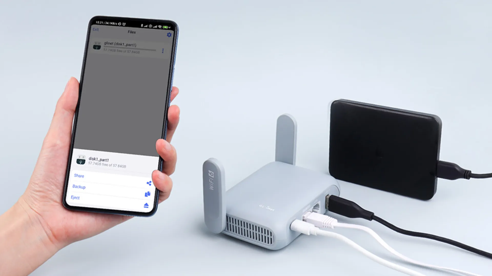

# Week 1.1 Lab: Discovering Network Hardware

## Lab Overview
Use command-line tools to discover and identify the network hardware connecting your computer to the world. Learn to "see" the switches and routers that make networking possible.

**Time Required:** 45 minutes  
**Environment:** GitHub Codespaces or Raspberry Pi 4  
**Difficulty:** Beginner  
**Focus:** Practical hardware identification

---

## Learning Objectives
By the end of this lab, you will be able to:
- Use `ip` and `ifconfig` commands to examine network connections
- Identify your default gateway (router)
- Trace the path data takes through network hardware
- Understand how your device connects to switches and routers

---

## Pre-Lab Setup

### Option A: GitHub Codespaces
1. Open your NetPi repository in Codespaces
2. Open a new terminal
3. Test basic connectivity: `ping -c 3 google.com`

### Option B: Raspberry Pi 4
1. Boot your Raspberry Pi and open Terminal
2. Ensure you're connected to Wi-Fi or ethernet
3. Test basic connectivity: `ping -c 3 google.com`

---

## Part 1: Discovering Your Network Connection

### Step 1.1: What's My Network Setup?

Let's see how your computer is connected to the network:

```bash
# Modern way to see network interfaces
ip addr show
```

**Your output will look something like:**
```
1: lo: <LOOPBACK,UP,LOWER_UP> mtu 65536 qdisc noqueue state UNKNOWN
    inet 127.0.0.1/8 scope host lo
2: eth0: <BROADCAST,MULTICAST,UP,LOWER_UP> mtu 1500 qdisc fq_codel state UP
    inet 192.168.1.100/24 brd 192.168.1.255 scope global eth0
```

### Step 1.2: Understanding the Output

**Record your findings:**

1. **How many network interfaces do you see?** `________________`

2. **What's your IP address?** (Look for `inet` that's NOT 127.0.0.1) `________________`

3. **Is your connection wired (eth0) or wireless (wlan0)?** `________________`

### Step 1.3: Alternative Command (Older Systems)

```bash
# Traditional way (if available)
ifconfig
```

**Question:** Do you see the same information? Which command gives clearer output?

---

## Part 2: Finding Your Router (Default Gateway)

### Step 2.1: Who's My Router?

Your **default gateway** is the router that connects your local network to the internet:

```bash
# Find your default gateway (router)
ip route show default
```

**Example output:**
```
default via 192.168.1.1 dev eth0 proto dhcp src 192.168.1.100 metric 100
```

### Step 2.2: Understanding Router Information

**Record your router details:**

1. **Router IP address:** (the number after "via") `________________`

2. **Interface used:** (after "dev") `________________`

3. **Connection type:** (wired ethernet or wireless) `________________`

### Step 2.3: Test Router Connection

```bash
# Test if you can reach your router
ping -c 3 [YOUR_ROUTER_IP]
```

Replace `[YOUR_ROUTER_IP]` with the IP you found above (probably 192.168.1.1 or 192.168.0.1)

**Results:**
- **Average response time:** _______ ms
- **Packets lost:** _______ (should be 0!)

---

## Part 3: Mapping Your Network Path

### Step 3.1: Trace Route to the Internet

Let's see the path your data takes through different routers:

```bash
# Trace path to Google (might take 30 seconds)
traceroute google.com
```

**Note:** If `traceroute` isn't available, try:
```bash
# Install traceroute by apt
sudo apt-get update
sudo apt-get install -y net-tools iputils-ping iputils-tracepath traceroute mtr-tiny dnsutils tcpdump
```

### Step 3.2: Analysing the Route

Your output shows each "hop" (router) your data passes through:

```
1  192.168.1.1 (192.168.1.1)  1.234 ms
2  10.0.0.1 (10.0.0.1)  15.678 ms  
3  203.50.6.5 (203.50.6.5)  25.234 ms
```

**Identify the hardware:**

1. **Hop 1:** This is your _____________ (home/school router)

2. **Hop 2:** This is likely your ISP's _____________ (local router/switch)

3. **Hops 3+:** These are _____________ routers across the internet

**Count the hops:** How many routers does your data pass through? _______

---

## Part 4: Exploring Network Topology

### Step 4.1: Understanding Your Local Network

```bash
# See all network routes
ip route show
```

This shows how your computer knows where to send different types of data.

### Step 4.2: Identify Network Ranges

Look for lines like:
- `192.168.1.0/24` = Your local network (switch territory)
- `default via 192.168.1.1` = Everything else goes to router

**Questions:**

1. **What's your local network range?** `________________`
   (Hint: Look for something like 192.168.x.0/24)

2. **How many devices could theoretically connect to your local network?** 
   - `/24` network = _______ possible devices

### Step 4.3: Network Interface Details

```bash
# Get detailed interface information
ip link show
```

**Record interface details:**

| Interface | Status (UP/DOWN) | Type (ethernet/wireless) |
|-----------|------------------|--------------------------|
| lo        |                  |                          |
| eth0      |                  |                          |
| wlan0     |                  |                          |

---

## Part 5: Physical Hardware Investigation

### Step 5.1: Identifying Physical Connections

**If using Raspberry Pi:**
1. Look at the ethernet port - is there a cable connected?
2. Check for Wi-Fi connection in the system tray
3. Are there blinking lights on your network cable/router?


### Step 5.2: Router Investigation (If Accessible)

 Source: https://www.gl-inet.com/

**At home/school, look for:**
- A box with multiple ethernet ports (this is likely a switch)
- A box with an antenna and "WAN" port (this is likely a router)
- Blinking lights showing network activity

**Record what you find:**
- **Number of ethernet ports on your router:** _______
- **Router brand/model:** _______
- **Status lights:** All green? Any red/orange? _______

---

## Part 6: Network Hardware Performance

### Step 6.1: Testing Switch Performance (Local Network)

```bash
# Test speed to your router (local switch/router)
ping -c 10 [YOUR_ROUTER_IP]
```

**Results:**
- **Minimum time:** _______ ms
- **Maximum time:** _______ ms  
- **Average time:** _______ ms

**What this tells you:** Lower times = better local network performance

### Step 6.2: Testing Router Performance (Internet)

```bash
# Test internet connection through router
ping -c 10 8.8.8.8
```

**Results:**
- **Minimum time:** _______ ms
- **Maximum time:** _______ ms
- **Average time:** _______ ms

**Compare:** Is internet slower than local network? By how much?

---

## Reflection Questions

### Hardware Understanding

1. **Switch vs Router Identification:** From your commands, which IP address represents:
   - Your router? `________________`
   - Your local switch? `________________`

2. **Data Flow:** Describe the path your data takes from your computer to Google:
   Computer → _________ → _________ → _________ → Google

3. **Performance Analysis:** Why is pinging your router faster than pinging Google?
   `_______________________________________________`

### Real-World Applications

4. **Network Design:** If you were setting up a school computer lab with 20 computers, what hardware would you need?
   `_______________________________________________`

5. **Troubleshooting:** If your internet was slow, which ping test would help you figure out if the problem is local or with your ISP?
   `_______________________________________________`

---

## Extension Activities (If Time Permits)

### Advanced: Network Statistics
```bash
# See detailed network statistics
cat /proc/net/dev
```

### Challenge: Find All Local Devices
```bash
# Scan your local network (replace with your network range)
nmap -sn 192.168.1.0/24
```

**Note:** This might not work in Codespaces due to restrictions.

---

## Common Network Configurations

**Typical Home Setup:**
```
Internet → ISP Router → Home Router → Switch (built-in) → Your Device
```

**Typical School Setup:**
```
Internet → School Router → Core Switch → Classroom Switch → Your Computer
```

**Your Setup:** Draw your network configuration:
```
Internet → _______ → _______ → _______ → Your Computer
```

---

## Troubleshooting

**If commands don't work:**
- `ip` command not found → try `ifconfig`
- `traceroute` not found → try `tracepath`
- Permission denied → some commands might need `sudo` (not available in Codespaces)
- No internet → check your connection with `ping 8.8.8.8`

**If you see unexpected results:**
- Virtual environments (like Codespaces) might show simplified network setups
- This is normal! The concepts still apply

---

## Lab Submission

**Complete this network summary:**

1. **My IP address:** `________________`
2. **My router's IP:** `________________`  
3. **Number of hops to Google:** `________________`
4. **Local network ping time:** _______ ms
5. **Internet ping time:** _______ ms
6. **Physical connection type:** `________________` (ethernet/wireless/virtual)

**Answer in one sentence each:**

7. **What's the difference between your router and switch?**

8. **Why does data take multiple hops to reach Google?**

9. **What would happen if your router stopped working?**

---

## Next: Week 1.1 Code Practice