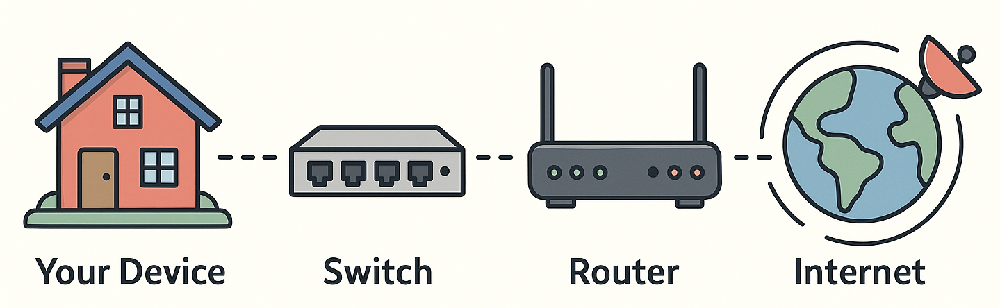

# Week 1.1 Lesson: Network Hardware Components

## Learning Objectives
By the end of this lesson, you will be able to:
- Explain what routers and switches do in simple terms
- Identify the difference between connecting networks vs connecting devices
- Recognise network hardware in real-world settings
- Understand how data flows through network components

---

## What Makes a Network Work?

Imagine you're trying to get a message from your bedroom to your friend's house across town. You can't just shout—you need a system to get the message there. Networks are like postal systems for digital messages, and they need special equipment to make it all work.

### The Network Post Office Analogy

Think of network hardware like Australia Post:

**🏠 Your Device** = Your house (where the message starts)  
**🔀 Switch** = Local post office (sorts mail for your neighbourhood)  
**🌐 Router** = State sorting facility (sends mail between cities)  
**📡 Internet** = The whole postal network across Australia

---

## Switches: The Neighbourhood Connectors

### What is a Switch?

A **switch** is like the local post office in your suburb. Its job is to connect all the devices in one location (like a school, office, or home) so they can talk to each other.

#### Real-World Example: Your School
In your school's computer lab:
- All the student computers plug into a switch
- The teacher's computer connects to the same switch
- The printer connects to the switch
- Now everyone can share files and print!

### How Switches Work

**The Smart Sorting System:**
1. **Learning**: Switch remembers which device is plugged into which port
2. **Deciding**: When data arrives, switch knows exactly where to send it
3. **Forwarding**: Sends data directly to the right device (no broadcasting!)

**Switch Analogy - Classroom Helper:**
Imagine a classroom helper who:
- Knows exactly where each student sits
- Takes messages and delivers them directly to the right person
- Never gives your private note to the wrong student
- Gets faster at delivery as they learn everyone's location

### Australian Example: Telstra Exchange

Your local Telstra exchange has massive switches that connect all the phone lines and internet connections in your suburb. When you call your neighbour, the switch keeps that call local—it doesn't need to go to Sydney!

---

## Routers: The City Connectors

### What is a Router?

A **router** is like the main sorting facility that connects different postal regions. It connects separate networks together and decides the best path for data to travel between them.

#### Real-World Example: Home to School
When you access your school's website from home:
1. **Home router**: Sends your request onto the internet
2. **ISP routers**: Forward your request through the internet
3. **School router**: Receives your request and sends back the webpage
4. **Return journey**: All routers work together to get the webpage back to you

### How Routers Work

**The GPS for Data:**
1. **Route Discovery**: Routers build maps of all available network paths
2. **Best Path Selection**: Choose the fastest/most efficient route
3. **Traffic Direction**: Send data packets along the chosen path
4. **Backup Routes**: If one path is busy, find another way

**Router Analogy - GPS Navigation:**
Like your phone's GPS, routers:
- Know all the "roads" (network connections) between locations
- Calculate the fastest route to your destination
- Redirect traffic if there's a "traffic jam" (network congestion)
- Can find alternative routes if the main road is blocked

### Australian Context: NBN Network

The National Broadband Network (NBN) uses thousands of routers across Australia:
- **Local routers**: In your neighbourhood connecting homes
- **Regional routers**: Connecting cities like Melbourne to Ballarat  
- **Backbone routers**: Connecting states (Melbourne to Sydney)
- **International routers**: Connecting Australia to the world

---

## Key Differences: Switches vs Routers

| Aspect | Switch | Router |
|--------|--------|--------|
| **Job** | Connect devices in ONE location | Connect DIFFERENT networks |
| **Scope** | Local (classroom, office, home) | Wide area (cities, countries) |
| **Intelligence** | Remembers device locations | Knows network maps and routes |
| **Analogy** | Local post office | State sorting facility |
| **Example** | School computer lab | Home internet connection |

### Memory Tip: "SL vs RW"
- **S**witch = **L**ocal (Same Location)
- **R**outer = **W**ide area (Wider World)

---

## Data's Journey: Following a Web Request

Let's follow what happens when you search "weather Sydney" on your school computer:

### Step 1: Within Your School (Switch Territory)
1. You type and press Enter
2. **School switch** receives your request
3. Switch sends it to the school router
4. All happening within your school network

### Step 2: Between Networks (Router Territory)  
1. **School router** receives the web request
2. Routes it to your ISP (like Telstra or Optus)
3. **ISP routers** forward it across Australia
4. Eventually reaches Google's servers

### Step 3: Coming Back Home
1. Google's servers send back the weather data
2. **Multiple routers** work together to find the path back
3. **School router** receives the response
4. **School switch** delivers it to your computer
5. You see Sydney's weather!

**Time taken**: Usually under 100 milliseconds (faster than blinking!)

---

## Real-World Spotting Guide

### At Home
**Router**: That box from Telstra/Optus with flashing lights and aerial
**Switch**: Might be built into your router, or a separate box if you have lots of devices

### At School  
**Switches**: In computer labs, usually under desks or in network cupboards
**Router**: Main office or IT room, connects school to the internet

### In Public
**Routers**: Mobile phone towers, internet exchange buildings
**Switches**: Inside shops connecting their tills and computers

---

## Australian Network Infrastructure

### Major Internet Exchanges
- **NEXTDC**: Data centres in Melbourne, Sydney, Brisbane
- **Equinix**: International connections in major cities
- **Pipe Networks**: High-speed connections between capitals

### Fun Fact: The Southern Cross Cable
A massive undersea cable connecting Australia to New Zealand and the USA. It contains routers that handle international internet traffic—your TikTok videos from America travel through these!

---

## Quick Check: Can You Identify?

**Scenario 1**: In your classroom, 30 computers all need to access the same shared printer and talk to each other.
- **What hardware do you need?** ________________
- **Why?** ________________

**Scenario 2**: Your school network needs to connect to the internet so students can access Google Classroom.
- **What hardware do you need?** ________________  
- **Why?** ________________

**Scenario 3**: You're gaming online with friends. Your data needs to travel from Melbourne to a game server in Sydney.
- **What hardware makes this possible?** ________________
- **How many different networks might your data cross?** ________________

Click for answers

**Scenario 1**: Switch - connects multiple devices in the same location  
**Scenario 2**: Router - connects your school network to external networks (internet)  
**Scenario 3**: Multiple routers - your data crosses home network, ISP network, backbone networks, and game server network

---

## Common Misconceptions

**❌ "Routers and switches do the same thing"**
✅ Switches connect devices locally, routers connect different networks

**❌ "More expensive = always better"**  
✅ You need the right tool for the job. A $2000 enterprise router is overkill for a home with 3 devices

**❌ "Wi-Fi is a different type of network"**
✅ Wi-Fi is just a wireless way to connect to switches/routers—the underlying principles are the same

---

## Coming Up Next

In our **Lab session**, we'll use command-line tools to discover and identify the network hardware around us. You'll learn to use `ip` and `ifconfig` commands to see exactly how your computer connects to switches and routers.

In **Code Practice**, we'll write simple Python scripts to automatically discover network devices and map out the hardware topology!

---

## Key Terms to Remember

- **Switch**: Connects devices within the same network location
- **Router**: Connects different networks together and routes traffic between them
- **Local Network**: Devices connected by switches (like your school's computers)
- **Wide Area Network**: Different locations connected by routers (like your home to your school)
- **Data Packet**: Small chunks of information that travel through network hardware

## Next: Week 1.1 Lab