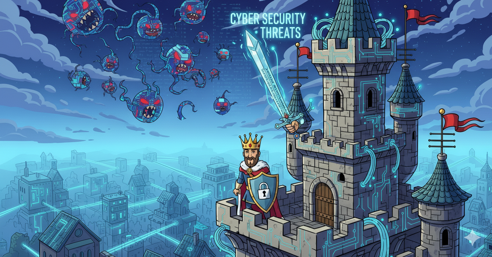

# Week 2.1 Lesson: Cyber Security Threats & Attack Vectors

## Learning Objectives
By the end of this lesson, you will be able to:
- Identify the most common cyber security threats targeting networks
- Explain how attackers exploit network vulnerabilities
- Recognise attack patterns and methodologies
- Understand why the network knowledge from Week 1 is crucial for security

---

## Why Cyber Security Matters Right Now

### The Australian Threat Landscape

In 2024, Australia faced over **76,000 cyber crime reports** - that's one every 7 minutes! Recent major incidents include:

- **Medibank cyberattack**: 9.7 million customer records stolen
- **Optus data breach**: 11 million customers affected  
- **Latitude Financial**: Customer data compromised
- **Local schools and councils**: Regular ransomware attacks

**The reality**: If you're connected to a network, you're a potential target.

---

## The Three Attack Categories

Think of cyber attacks like different types of break-ins:

**🏠 Physical Break-in** = **Network Intrusion** (unauthorised access)  
**📦 Package Theft** = **Data Breach** (stealing information)  
**🦠 Spreading Illness** = **Malware** (infecting systems)

---

## Category 1: Unauthorised Access - The Digital Break-in

### What is Unauthorised Access?

When someone gains access to networks, systems, or accounts they shouldn't have. It's like someone picking the lock on your house and wandering around inside.

### Common Methods

#### 1. **Weak Passwords** (The Unlocked Door)
**Example**: Using "password123" or "admin" for important accounts

**Real Case**: In 2023, a Melbourne school's network was compromised because the Wi-Fi password was "password123" - attackers sat in the car park and accessed internal systems.

#### 2. **Unpatched Software** (The Broken Window)
**Example**: Running old versions of Windows or web applications with known security holes

**Your Network Knowledge**: Remember those open ports you found with `ss -tuln`? Each open port runs software that might have vulnerabilities.

#### 3. **Social Engineering** (The Fake ID)
**Example**: Calling someone pretending to be from IT support and asking for passwords

**Real Case**: Operation Protego revealed Australia's largest GST fraud where 57,000 people stole $2 billion from the ATO tax system through fake business GST refunds promoted on social media. The scheme was so simple that fraudsters created fake businesses, submitted false GST claims, and received millions in refunds without any real business activity. 

**Australian Context**: Scammers often pretend to be from Telstra, ATO, or banks to get login credentials.

#### 4. **Physical Access** (The Unlocked Back Door)
**Example**: Plugging a USB device into an unattended computer

**Real Case**: In 2023, Chinese espionage group "Mustang Panda" infected a European healthcare institution through USB drives. A hospital employee attended a conference in Asia, shared files via USB with colleagues, and unknowingly brought back infected drives. The malware spread through the hospital's network, stealing sensitive data and creating backdoors for remote access. The attack showed how USB devices can bypass even strong network security.

**School Example**: Someone could plug a device into your school's switch (remember those from Week 1?) and gain network access.

---

## Category 2: Data Breaches - The Information Heist

### What is a Data Breach?

When sensitive information is accessed, stolen, or exposed without permission. It's like someone photocopying all your personal documents.

### Types of Stolen Data

#### **Personal Information**
- Names, addresses, phone numbers
- Medicare numbers, driver's licence details
- Financial information and credit card data

#### **Business Information** 
- Customer databases and email lists
- Financial records and strategic plans
- Intellectual property and trade secrets

#### **Government Information**
- Classified documents and security protocols
- Citizen data and service records
- Infrastructure and defence information

### How Data Moves Through Networks

**Your Week 1 Knowledge Applied:**
- Data travels through **switches** (local network) - vulnerable to local attackers
- Then through **routers** (wide area) - vulnerable to internet-based attacks  
- **Multiple hops** (remember `traceroute`?) = multiple points where data can be intercepted

---

## Category 3: Malware - The Digital Infection

### What is Malware?

Malicious software designed to damage, disrupt, or gain unauthorised access to systems. It's like a virus that spreads through your network.

### Common Malware Types

#### **Ransomware** (The Digital Kidnapper)
- Encrypts your files and demands payment
- **Australian Impact**: Disrupted hospitals, councils, and businesses
- **Network Spread**: Uses network connections to infect other devices

#### **Trojan Horse** (The Fake Gift)
- Disguised as legitimate software
- Creates backdoors for future attacks
- **Example**: Fake antivirus software that actually steals data

#### **Botnet** (The Zombie Army)
- Infected computers controlled remotely
- Used for spam, attacks, or cryptocurrency mining
- **Your computer becomes a weapon** without you knowing

#### **Spyware** (The Silent Watcher)
- Secretly monitors and reports your activities
- Steals passwords, browsing habits, personal information
- Often bundled with "free" software

---

## Attack Methodology: The Hacker's Playbook

### Phase 1: Reconnaissance (Information Gathering)
**What attackers do:**
- Use `ping` and `traceroute` (just like you learned!) to map networks
- Search social media and websites for information
- Identify potential targets and vulnerabilities

**Your Week 1 Skills**: Attackers use the same commands you learned, but for malicious purposes.

### Phase 2: Scanning (Finding Weaknesses)
**What attackers do:**
- Use tools like `nmap` to find open ports
- Test for weak passwords
- Look for unpatched software

**Coming in Week 2 Lab**: You'll learn to do this ethically for security assessment.

### Phase 3: Gaining Access (The Break-in)
**What attackers do:**
- Exploit the weaknesses found in scanning
- Install malware or create backdoors
- Escalate privileges to gain more control

### Phase 4: Maintaining Access (Setting Up Camp)
**What attackers do:**
- Create persistent access methods
- Cover their tracks by deleting logs
- Move laterally through the network

### Phase 5: Actions on Objectives (The Heist)
**What attackers do:**
- Steal data, money, or intellectual property
- Disrupt operations or hold systems hostage
- Use compromised systems for further attacks

---

## Australian Cyber Threat Examples

### Critical Infrastructure Attacks
- **Power grids**: Attempts to disrupt electricity supply
- **Water systems**: Targeting treatment and distribution
- **Transport**: Attacks on traffic management and railways
- **Telecommunications**: Targeting NBN and mobile networks

### Targeting Australian Organisations
- **Government agencies**: Defence, tax office, health departments
- **Financial institutions**: Big four banks, superannuation funds
- **Education**: Universities and schools with valuable research
- **Healthcare**: Hospitals with critical patient data

### Why Australia is Targeted
- **Geographic isolation**: Attacks can go undetected longer
- **Resource wealth**: Mining and energy data valuable to foreign actors
- **Five Eyes member**: Intelligence sharing makes us a spy target
- **English-speaking**: Easier for international criminal groups

---

## Connecting to Your Network Knowledge

### How Week 1 Knowledge Applies to Security

**Switches** (from Week 1.1):
- **Security risk**: If compromised, attacker sees all local traffic
- **Protection**: Network segmentation, port security

**Routers** (from Week 1.1):
- **Security risk**: Control internet access, can redirect traffic
- **Protection**: Firmware updates, access control lists

**Network Commands** (from Week 1.3):
- **`ping`**: Attackers use this for reconnaissance
- **`ss`**: Shows which services are exposed to attack
- **`traceroute`**: Reveals network infrastructure to attackers

**The Point**: Everything you learned about networks in Week 1 is exactly what attackers need to understand to be successful!

---

## Defence Mindset vs Attack Mindset

### Attacker Thinking
- "What networks can I find?"
- "Which devices are running services?"
- "What ports are open and unprotected?"
- "How can I move from one network to another?"

### Defender Thinking  
- "What am I exposing to the internet?"
- "Are my network devices properly configured?"
- "Am I monitoring for suspicious activity?"
- "Do I have backups if something goes wrong?"

**Your Role**: Use the same tools and knowledge as attackers, but for protection instead of exploitation.

---

## Quick Check: Threat Identification

**Scenario 1**: You receive an email claiming to be from your bank asking you to click a link and "verify your account details."
- **What type of attack is this?** `_________________`
- **What should you do?** `_________________`

**Scenario 2**: Your computer starts running very slowly, and you notice network traffic when you're not using the internet.
- **What might this indicate?** `_________________`
- **Which Week 1 command could help investigate?** `_________________`

**Scenario 3**: Someone calls your school's IT department claiming to be from Microsoft and asking for the administrator password to "fix a security issue."
- **What type of attack is this?** `_________________`
- **Why is this targeting your network specifically?** `_________________`

Click for answers

**Scenario 1**: Phishing attack - Delete the email and contact your bank directly  
**Scenario 2**: Possible malware/botnet - Use `ss -tuln` to check connections  
**Scenario 3**: Social engineering - Legitimate companies never ask for passwords over the phone

---

## Common Misconceptions

**❌ "Cyber attacks only target big companies"**
✅ Small businesses and individuals are often easier targets with weaker defences

**❌ "Antivirus software protects against everything"**  
✅ Modern attacks often bypass traditional antivirus through network exploitation

**❌ "Strong passwords are enough"**
✅ Network vulnerabilities can be exploited regardless of password strength

**❌ "Cyber security is just an IT problem"**
✅ Successful attacks often combine technical and social engineering methods

---

## Coming Up Next

### Week 2.2 Lab
You'll learn to use `nmap` to scan for vulnerabilities - the same technique attackers use for reconnaissance, but you'll use it to find and fix problems before the bad guys do.

### Week 2.2 Code Practice  
Build your **Smart Vulnerability Analyzer** that takes raw `nmap` output and converts it into clear, actionable security reports with risk scores.

---

## Key Terms to Remember

- **Threat Vector**: The path or method used by attackers to gain access
- **Vulnerability**: A weakness in a system that can be exploited
- **Social Engineering**: Manipulating people to reveal information or perform actions
- **Reconnaissance**: Information gathering phase of an attack
- **Lateral Movement**: Moving through a network after initial compromise
- **Persistent Access**: Maintaining long-term access to compromised systems

## Next: Week 2.1 Lab