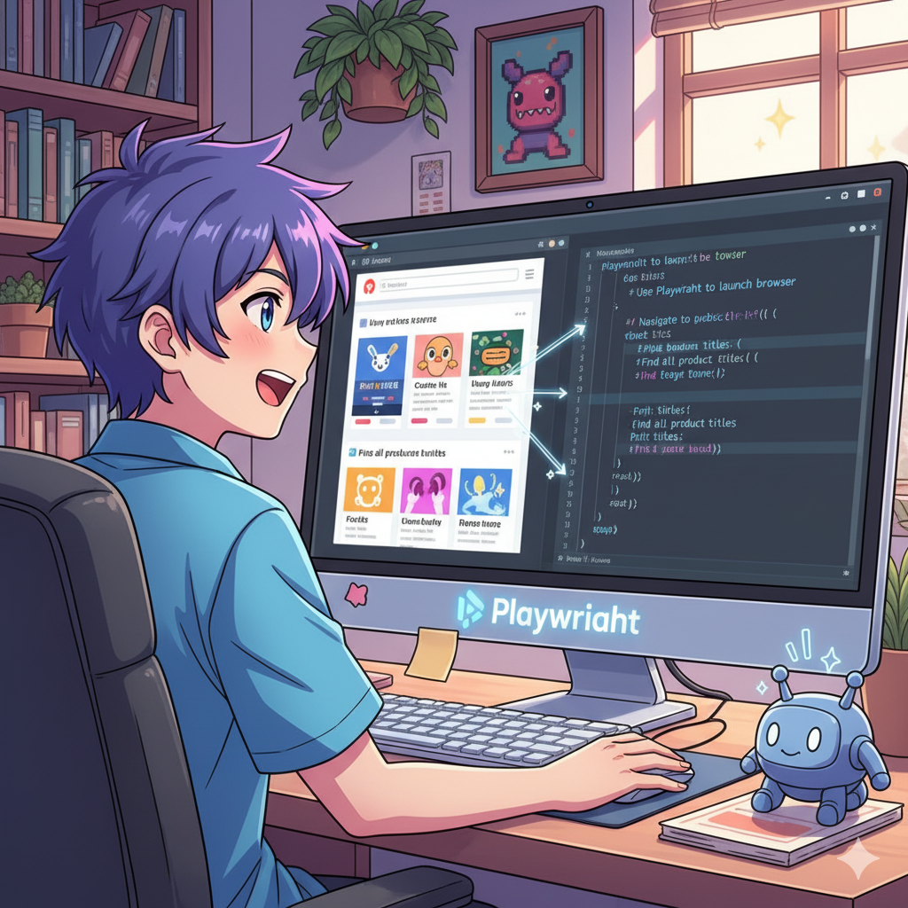
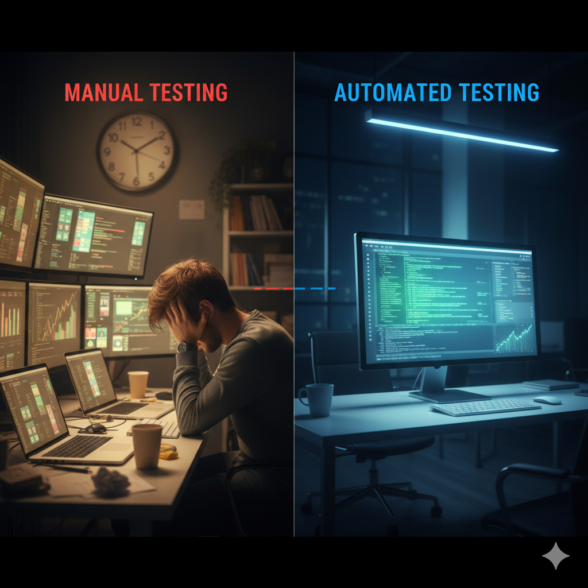
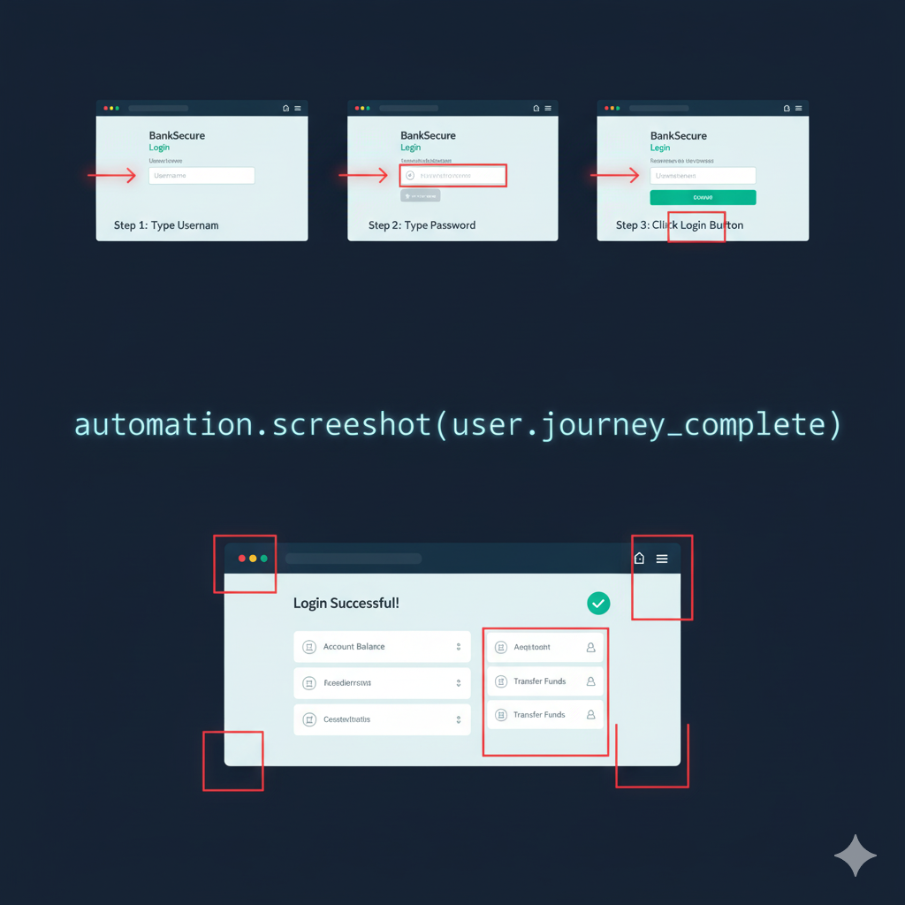

# Week 3.1 Lesson: Web Automation with Playwright

**Learning Focus:** Why security professionals use robots to test websites

---

## Activity 1: Learning Objectives and Opening

### What You'll Learn Today

By the end of this lesson, you will understand:

- Why security professionals use robots to test websites
- How browser automation helps find security problems faster than humans
- The difference between manual testing and automated testing
- What career opportunities exist in web security automation

### Think About This

**Imagine if you had a robot that could use your computer exactly like you do - clicking, typing, taking screenshots - but never getting tired, never making mistakes, and working 1000 times faster.**

**Your task:** Write down one thing you would want this robot to do for you.

---

## Activity 2: Meet Playwright - Video Analysis

### Video Watching Task

**Watch this video:** [Playwright Introduction by Microsoft](https://youtu.be/4-LwodVujTg) (48 seconds)

**Your job while watching:** Fill in this information sheet

#### Video Notes Sheet

**About Playwright:**

- What is it? ________________________________
- Who made it? ________________________________
- What type of software? (circle one): **Paid / Free / Open source**

**What Playwright Can Do:**

1. ---
    
2. ---
    
3. ---
    

**Key Phrase:** Complete this sentence from the video: "Playwright is like a ________________________________"

### Video Analysis Discussion

**Turn to your partner and compare notes:**

1. What did Playwright remind you of?
2. Which capability sounds most useful?
3. What questions do you have?

**Share with class:** One interesting thing you noticed

### Connecting to Real World

**Based on the video, answer these:**

1. **Speed:** If Playwright is "really fast," how might this help security teams?
    
    ---
    
2. **Reliability:** The video mentions Playwright "waits" and "retries." Why is this important for testing?
    
    ---
    
3. **Browsers:** Playwright works on "all modern browsers." Why does this matter for security testing?
    
    ---
    

---

## Activity 3: The Scale Problem Challenge

### The Impossible Task

**Scenario:** Your parents want you to check your phone 2,500 times tonight to make sure it's working properly. Each check means:

- Open every app
- Test every feature
- Take a screenshot
- Each check takes 2 minutes

### Your Challenge (Individual Work)

**Calculate:**

1. How many hours would this take? ________
2. How many days without sleep? ________
3. Is this humanly possible? ________

### Real Business Examples

Companies face this same impossible challenge:

- **Commonwealth Bank**: Tests 5,000+ web pages daily for security
- **Netflix**: Tests streaming on 2,000+ device combinations
- **myGov**: Verifies 50+ government services work for 8 million users
- **Your School Portal**: Tests login systems, grade access, timetables

**The Solution:**

- **Manual testing**: 1 person, 1 month of solid work
- **Automated testing**: 1 computer, 1 night while everyone sleeps

### Discussion Activity

**Step 1:** Turn to the person next to you  
**Step 2:** Discuss: What apps do you use daily that probably get tested by robots like Playwright?  
**Step 3:** Make a list of 3 apps together  
**Step 4:** Share one interesting example with the class

---

## Activity 4: Playwright in Action - Screenshot Automation

### Watch Real Playwright Automation

**Watch this video:** [Playwright Screenshot Automation](https://www.youtube.com/watch?v=Jfi08dULAmw) (2 minutes 11 seconds)

**Your mission:** You're observing a professional demonstrating Playwright. Fill in this analysis sheet:

#### Playwright Demo Analysis Sheet

**What the Demo Shows:**

- **Website being tested:** ________________________________
- **Main task being automated:** ________________________________
- **Visual feature added:** ________________________________
- **End result:** ________________________________

**The Magic Command:** Write down the simple instruction that made all this happen: "________________________________"

**Time Savings:**

- **Manual process would take:** ________________________________
- **Automated process took:** ________________________________
- **Why this matters:** ________________________________

### Professional Applications Analysis

**Your task:** Based on what you just watched, answer these security questions:

#### Security Team Applications

**1. Evidence Collection:** How could security teams use Playwright's screenshot feature?

---

**2. Documentation:** The video shows creating user journey documentation. How might this help cybersecurity?

---

**3. Testing Efficiency:** The presenter mentions this would "take so long" manually. What does this mean for security testing?

---

**4. Visual Verification:** The red borders show exactly what Playwright interacted with. Why is this important for security testing?

---

### Real-World Security Scenarios

**Work in pairs:** Read these scenarios and discuss how Playwright's screenshot automation could help:

#### Scenario 1: Bank Security Testing

_Commonwealth Bank needs to verify their login process works correctly and securely on different devices._

**How Playwright helps:** ________________________________

#### Scenario 2: School Portal Security

_Your school needs to document how students should safely access their grades online._

**How Playwright helps:** ________________________________

**Choose one scenario and present to class:** How automation makes security testing better

---

## Activity 5: Career Reality Check

### Australian Cybersecurity Jobs Using Playwright

**Read about these real careers, then answer the questions:**

#### Security Tester at Commonwealth Bank

_"I use Playwright to test our online banking every night. The robot logs in as different customer types, tries to transfer money, checks if security warnings appear correctly. The automatic screenshots show me exactly what happened when tests fail."_

#### IT Security Analyst at Monash University

_"Playwright helps me test our student portal security. I can create step-by-step visual guides showing students how to log in safely. The automation runs 50,000 different test scenarios overnight."_

#### DevOps Engineer at Atlassian (Melbourne)

_"Every time our developers change code, Playwright automatically takes screenshots of all our security features working. If something breaks, we see exactly what went wrong immediately."_

**Questions:**

1. **Which job sounds most interesting to you and why?**
    
    ---
    
2. **How do the automatic screenshots help these professionals?**
    
    ---
    
3. **What would happen if these companies didn't use automation like Playwright?**
    
    ---
    

### Skills Connection Check

**Connect the dots:** How does Playwright build on what you've already learned?

|Previous Learning|How Playwright Uses It|
|---|---|
|Week 1: Networks and how data travels|_________________________|
|Week 2: Finding security vulnerabilities|_________________________|
|Today: Browser automation|_________________________|

---

## Lesson Wrap-Up and Next Steps

### Exit Ticket - What You Now Know

**Complete these statements based on today's learning:**

1. **Playwright is useful for cybersecurity because:** ________________________________
    
2. **The biggest advantage of automation over manual testing is:** ________________________________
    
3. **One way automatic screenshots help security teams is:** ________________________________
    
4. **The most surprising thing I learned today was:** ________________________________
    

### Next Lesson Preview

**Week 3.2 Coming Up: Building Network Monitoring Dashboards**  
Next lesson, you'll learn how professionals monitor thousands of devices simultaneously using dashboards. The Playwright automation we learned about feeds data into these monitoring systems that security teams watch 24/7.

**Think about:** How might the automatic screenshots and test results from Playwright be displayed on a security team's dashboard?
